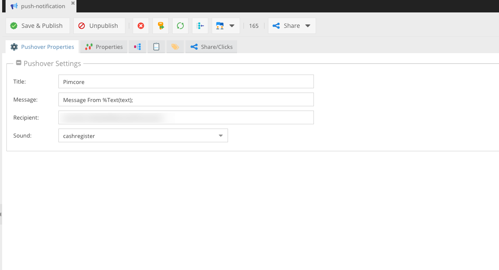
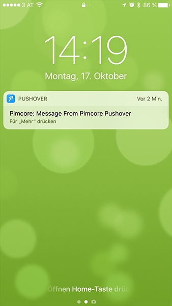

# Pimcore - Pushover Document

[](LICENSE.md)

Adds a new Document Type called "Pushover" to send notifications via Pushover. The main reason to implement it as Document is: You can relate it to different kind of objects and use "send" Method to trigger the event.

### This Plugin needs at least Pimcore build 3993



## Getting started

* Download Plugin and place it in your plugins directory
* Open Extension Manager in Pimcore and enable/install Plugin
* After Installation within Pimcore Extension Manager, you have to reload Pimcore
* Open Settings -> Definitions
* Add ```"capirussa/pushover-php" : "1.0"``` to your composer.json and install the requirements

or install it via composer on an existing pimcore installation

```
composer require dpfaffenbauer/pushover
```

or for the nightly dev version

```
composer require dpfaffenbauer/pushover dev-master
```

## Configure Pushover
Open Settings -> Pushover Settings and add your Application Token

## Send Pushover Message

Pushover uses Pimcore Placeholders for Title and Message.

See more here [https://www.pimcore.org/docs/latest/Development_Tools_and_Details/Placeholders/index.html](https://www.pimcore.org/docs/latest/Development_Tools_and_Details/Placeholders/index.html)

```php
$document = \Pimcore\Model\Document::getById(165);

$message = new \Pushover\Message();
$message->setDocument($document);
$message->setParams(
    ["text" => "Pimcore Pushover"]
);
$message->send();
```

